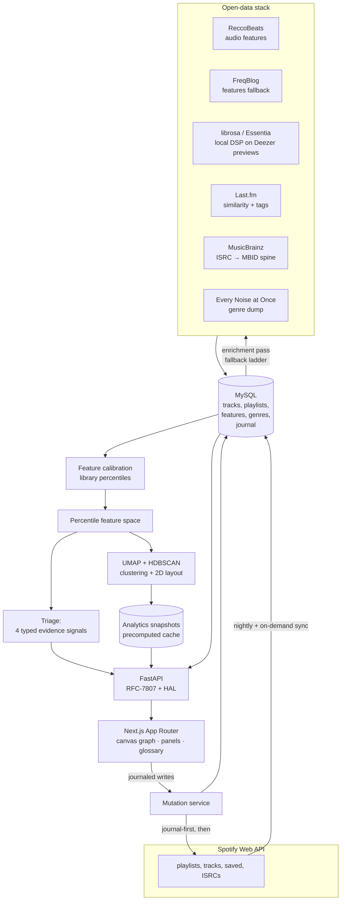

# crate — architecture

crate is a Spotify playlist-intelligence tool: it syncs a curated playlist library into its own
database, enriches every track and artist through open music-data sources, and renders the library
as an interactive graph you can reorganise — with an undo journal on every write back to Spotify.
Its defining constraint is also its most interesting property. Spotify closed the audio-features,
recommendations, and related-artists endpoints to new apps in late 2025, so crate has **no access
to the "good" APIs everyone's music-tech demos were built on**. The entire taste engine — the
per-track sound profile, the clustering, the discovery ranking, the destination suggestions — is
reconstructed from open data (ReccoBeats, Essentia via librosa, Last.fm, MusicBrainz, the Every
Noise at Once genre dump, Deezer previews) and normalised against the library's *own* distribution
rather than any borrowed Spotify-era threshold. What follows is how that works.

## System overview

The flow reads left to right through the stages above:

1. **Sync.** A nightly scheduler (plus on-demand triggers) pulls the user's playlists, their track
   memberships, saved tracks, and each track's ISRC into MySQL. crate keeps its own copy of the
   library so every downstream stage runs over local, queryable data rather than re-hitting
   Spotify.
2. **Enrichment.** A background pass walks un-enriched tracks and artists and fans out to the open
   stack down a fallback ladder, persisting audio features, artist similarity, tags, and genre
   weights. It re-fits the feature calibration at the end of each pass.
3. **Feature space.** Because the enriched values come from models whose distributions look nothing
   like Spotify's, crate never compares tracks by raw value. It builds a *percentile space* fitted
   on the whole enriched catalogue and ranks every track within it.
4. **Clustering & layout.** The percentile matrix (blended with a genre block) is projected with
   UMAP and clustered with HDBSCAN. The result — a 2D layout plus cluster labels — is precomputed
   into a snapshot cache, never computed in a request.
5. **Surfaces.** The API serves the graph, the discovery/insights readouts, and the triage
   suggestion engine to a Next.js frontend that renders the library as a canvas you can explore and
   reorganise.
6. **Writes.** Every change to a playlist goes through a journal-first mutation service: the inverse
   is recorded and committed *before* Spotify hears anything, so any write is one-click undoable
   even if it half-fails.

## The taste engine

This is the part worth reading closely. It is three cooperating pieces: a percentile feature space,
a two-embedding clustering pass, and a typed-evidence suggestion model.

### Percentile feature space

The enriched audio features come from Essentia-based models (ReccoBeats, and a local librosa
pipeline as the last fallback), whose distributions differ sharply from Spotify's now-inaccessible
audio-features endpoint — acousticness saturates near the top of its range, speechiness shifts by
roughly an order of magnitude, and so on. Any threshold learned against Spotify's distribution
("energy > 0.7 is high energy") is meaningless here.

So crate ranks. `PercentileSpace` (`services/analytics/percentiles.py`) is fitted on the sorted
distribution of every enriched track for each of nine continuous features (energy, valence,
danceability, acousticness, instrumentalness, liveness, speechiness, tempo, loudness — key and mode
are categorical and stay out). A track's value becomes its **rank within the library**: the
mean-rank convention, `(#below + 0.5·#equal) / n`, giving a value in `[0, 1]` where ties land
midway. A missing feature takes the neutral rank of `0.5` — the library median — so a gap neither
attracts nor repels a distance metric. The ranking population is deliberately the *whole* catalogue,
not any single playlist: "high energy" means high relative to everything the library knows.

The upshot is that every metric in the system — cluster distance, playlist centroid proximity,
discovery fit, sonic-fit evidence — operates on a comparable, self-calibrating `[0,1]` axis derived
from the user's own music, with nothing borrowed from the closed API. A companion calibration table
(`services/enrichment/calibration.py`) also stores per-feature p10/p50/p90 anchors, refreshed after
every enrichment pass, used for display and colour ramps.

### Clustering: two embeddings, genre-blended distance, quality-gated

The map (`services/analytics/clustering.py`) has a subtlety that most naive UMAP+HDBSCAN pipelines
get wrong: **the geometry you look at and the geometry you cluster are different jobs, and it runs
two separate embeddings for them.**

- The **display embedding** (`min_dist = 0.1`, `n_neighbors = 15`) spaces points out for legibility
  — this is the on-screen x/y.
- The **clustering embedding** (`min_dist = 0.0`, `n_neighbors = 30` — the standard
  "UMAP-for-clustering" recipe) packs each dense region tight so HDBSCAN can find the density
  valleys between groups.

HDBSCAN runs on the *clustering* embedding, and its labels are painted onto the *display* layout.
This matters for two reasons. First, clustering the raw nine-dimensional percentile matrix directly
produces a single dense hyperball with no density valleys — a degenerate result. Clustering the
tuned embedding is what turns that blob into a usable multi-cluster structure. Second, computing
cluster ids in one space while drawing hulls in another produces hulls that visibly disagree with
their labels; running both off the same projected geometry keeps them consistent.

**Genre in the distance.** Acoustic percentiles alone make clusters that are hard to name ("this
corner is… mid-energy?"). So the caller can concatenate a pre-weighted per-track genre block onto
the acoustic block before projection. That block (`load_genre_vectors` in `loaders.py`) is built by
joining each track's credited artists to genre weights from the Every Noise at Once dump, summing
per genre, restricting to the ~24 genres carrying the most total library weight, and L2-normalising
each track's vector so genre contributes a bounded, comparable block regardless of how many genres a
track spans. The genre block is scaled so it can carve legible ("this is the afrobeats corner")
groups without overwhelming the acoustic axes. One axis is deliberately dropped from the clustering
distance: loudness, which was measured to correlate with the energy rank strongly enough that
including both effectively double-counts energy and blurs the structure. Loudness is still stored
and used for display colour — only the clustering matrix drops it.

**Reproducibility and cost.** UMAP runs with a fixed random seed, which forces single-threaded,
exactly reproducible layouts — the same library always produces the same map (the code hashes the
rounded layout to prove it). That determinism costs single-threaded runtime, which is why the map is
never computed in a request path: an endpoint that finds a cold cache answers `202 Pending`, kicks
off the compute as a background task, and the client retries. The precomputed result lands in an
analytics-snapshot cache keyed on `(user, kind, playlist, owned-vs-followed scope)`.

**Quality gate.** HDBSCAN's `min_cluster_size` scales with library size (roughly one required member
per 200 tracks, floored so a tiny library doesn't shatter into specks and a large one doesn't
collapse into one blob). A `cluster_quality` function reports the cluster count, the largest
cluster's share, and the noise share so the parameters can be judged against a real target (a couple
dozen clusters, no single cluster dominating, bounded noise) rather than by eye. The map also
computes the adjusted Rand index between its clusters and the user's actual playlist assignment,
which is what powers the split/merge suggestions: a playlist that straddles two dense clusters is a
split candidate; several playlists sharing one dominant cluster are a merge candidate.

**Honest constraint.** The genre signal is only as good as the name-keyed join to the Every Noise
dump. The dump has no Spotify artist ids, so artist *name* (casefolded) is the working key
throughout — which means a track whose credited artists aren't in the dump, or whose names don't
match cleanly, gets a zero genre vector and simply doesn't move in the genre subspace. Genre
coverage is therefore a real ceiling on how legible the clusters get, not a solved problem.

### Triage: four typed evidence signals, never a blended score

The triage suggestion model (`services/triage/engine.py`) answers "where should this track go?" by
inverting the discovery machinery. Discovery scores many candidate tracks against *one* playlist;
triage scores *one* track against *all* of the user's owned playlists. The library loads once, every
playlist's centroid is precomputed once in percentile space (never recomputed per track), and the
filed track is transformed into that same space.

For each candidate playlist it computes **four separately-labelled evidence signals** and returns
them as four rows — deliberately never collapsed into a single opaque number:

- **Sonic fit** — proximity of the track to the playlist's centroid in percentile space
  (`1 − normalised Euclidean distance`), plus *which axes agree* (both above or both below the
  library median, and close). The evidence row names those axes, so the explanation is "similar
  energy, danceability to this playlist," not just a bar.
- **Artist overlap** — how many tracks by the filed track's artists are already in the playlist,
  saturating (a handful is already a strong signal).
- **Placement history** — where the track's *feature-space neighbours* (already-filed tracks within
  a percentile radius) actually ended up. If tracks that sound like this one keep landing in a
  particular playlist, that's evidence for it — a soft, data-driven learned prior with no model to
  train.
- **Vibe match** — whole-token overlap (unigrams + adjacent bigrams, word-level, casefolded) between
  the playlist's name/description and the track's genre tokens. Word-level matching means "Late
  Night Jazz" matches a "smooth jazz" tag on `jazz` but "classical" never matches "class".

The four signals combine into an ordering rank (sonic fit dominant, the others seasoning), but the
rank exists *only* to sort the list. The evidence rows carry the story, and each is a typed pydantic
model with a human summary and a structured detail payload — never a raw dict, never a blended score
presented as "the" answer. This is a design stance: the tool explains its reasoning in four
independently-inspectable pieces, so a suggestion the user disagrees with can be understood and
overruled rather than trusted blindly.

The same clustering machinery also powers a **cluster-grounded new-category proposal**
(`services/triage/cluster.py`): the current triage queue is itself clustered (bounded sample,
genre-blended, same two-embedding recipe, run only in a background task), and each dense cluster
becomes a proposed new playlist with a name derived from its dominant genre and its founding members
listed. The proposal is cached against a content hash of the queue's source and track set, so a
moved queue reads as a miss and recomputes rather than serving a stale suggestion.

## The write system

Every change crate makes to a user's real Spotify library is journal-first
(`services/mutations/service.py`). The contract is the same for every operation:

1. **Record the inverse and commit it first.** Before Spotify hears anything, the mutation journal
   stores exactly what would restore today's state (the pre-change listing, the created-playlist id,
   the saved-track ids) and commits. The undo path exists before the forward write does.
2. **Perform the Spotify writes**, planned by a reconcile planner.
3. **Mirror the result locally** — membership rows, change events, analytics-cache invalidation,
   and the journal's final status.

The reconcile planner (`services/mutations/planner.py`) is worth calling out because Spotify's write
primitives are awkward: a remove drops *all* occurrences of a track URI, and adds/reorders work on
positions. The planner turns an arbitrary `(current, target)` listing pair into a minimal
remove → append → single-item-move sequence that reproduces the target exactly — membership *and*
order — under those semantics, while preserving each track's original `added_at` everywhere except
re-added duplicates (the API offers no better primitive).

There are three tiers of write:

- **Single operations** — add, remove, reorder, create, rename, unsave. Each records its own inverse
  and applies through the planner.
- **Composite `file_track`** — the triage "file this track" action, which can add a track to several
  playlists, optionally create a new playlist seeded with the track (plus a cluster seed), and
  optionally unsave it — all recorded as **one** composite inverse so the whole filing is one-click
  undoable, without going through the preview/apply path.
- **Bulk set-algebra** — union/intersection/difference/dedupe/subset-sync across playlists, run as a
  two-phase preview → apply. The preview computes the exact per-playlist add/remove delta into a
  stored manifest and pins the library state with a `sha256` fingerprint of all membership and
  order. Apply replays that stored manifest *verbatim* — nothing is recomputed — and refuses with a
  `409` if the fingerprint no longer matches, meaning the library moved under the preview and it must
  be rebuilt. What you saw in the preview is exactly what gets written.

Failure handling is the point of the whole design. If a Spotify write fails mid-way, the journal
entry is marked `partial`, the affected playlist is re-read from Spotify so the local mirror matches
reality (a "self-heal"), and the entry stays undoable. Undo doesn't blindly replay — it reconciles
from the *actual* current remote listing back to the recorded inverse, so recovery works from any
half-applied state. Operations that touch Liked Songs write remote-first (the Spotify delete lands
before the local `is_removed` flip commits) so a nightly sync can never resurrect a
locally-removed-but-remotely-present like. This is the level of care a tool earns the right to touch
someone's real, curated library with.

## Enrichment: the open stack

Enrichment is what makes crate platform-independent. Five open sources feed it, orchestrated
(`services/enrichment/orchestrator.py`) down a fallback ladder with a shared rate-limit-and-backoff
seam:

- **ReccoBeats** — the primary audio-features source (Essentia-derived), batched by Spotify id.
- **FreqBlog** — the features fallback when ReccoBeats misses, metered against a hard monthly
  allowance so the pipeline stops cleanly at the budget rather than failing mid-month.
- **librosa / Essentia local DSP** — the last rung before "missing". When no upstream knows a track,
  its 30-second Deezer preview is downloaded and nine features are computed locally with librosa.
  These raw values live in their own distribution, so they are quantile-mapped into the ReccoBeats
  space before storage (the raw values kept alongside). The formulas are documented honestly in the
  code as the proxies they are — valence from mode-plus-brightness is flagged as weak, tempo is
  subject to the usual half/double ambiguity — so no downstream consumer over-trusts them.
- **Last.fm** — artist-to-artist similarity and folksonomy tags, which drive the discovery ranker's
  affinity signal.
- **MusicBrainz** — the identity spine. It resolves ISRCs to recording and artist MBIDs, which link
  a track to its artists and thence to genre data.
- **Every Noise at Once** — a static genre dump parsed into artist→genre weights, the semantic
  backbone of the clustering and vibe signals.

**The shared throttle** (`services/enrichment/throttle.py`) is a small but load-bearing piece: a
`RateLimiter` that spaces calls at each source's documented rate (MusicBrainz ~1/s, Deezer 4/s,
Last.fm 5/s, and so on) and a `request_with_backoff` helper that retries `429` and the transient 5xx
family per the `Retry-After` header, up to a bounded retry count, before returning the final response
for the caller to decide on. The clock and sleep are injectable, so the entire retry/backoff logic is
unit-tested with no real sleeping. Every client shares this one seam.

**MBID resolution and the conservative name-search fallback** deserve a note because it's where a
wrong answer does silent damage. The primary path resolves an artist's MBID from its tracks' ISRCs
via MusicBrainz (a strong, unambiguous match). When an artist's tracks carry no MusicBrainz-matchable
ISRC, crate falls back to a name search — but conservatively. A candidate is accepted only if it
clears a high relevance-score bar **and** its name normalises exactly equal to the one we're
resolving, **and** it is the *only* candidate to do so. If two same-named artists both clear the
bars, the result is ambiguous and crate accepts *neither* — because a wrong genre attribution
(poisoning every downstream cluster and suggestion for that artist) is worse than a missing one. How
each MBID was resolved (`isrc` vs `name_search`) is recorded on the row, so the looser matches are
auditable and reversible in bulk if the threshold ever proves too generous.

The whole pass is budget-bounded (a wall-clock deadline checked between per-track units, returning
partial progress rather than running unbounded), transient per-track network faults are isolated and
skipped rather than aborting the pass, and the slow 1/s MusicBrainz identity work is split into its
own pipeline stage so it never blocks the feature work the map depends on.

## Frontend architecture

The web app is Next.js (App Router) with Tailwind v4, shadcn/ui primitives, TanStack Query v5 for
data, Zustand for client state, and `motion` for animation. A few pieces are distinctive.

**Canvas rendering.** The library graph, the track field, and the artist galaxy are rendered on an
HTML5 canvas through a force-directed layout (`react-force-graph-2d`), not SVG — the node counts get
into the thousands and canvas is what keeps it smooth. Node colour is *data*: every dot's fill is its
sound, computed as an OKLCH colour where hue runs organic→electronic, chroma tracks an energy
composite, and lightness tracks valence — all from library percentiles, so similar-sounding tracks
are similarly coloured and an entity with no features yet renders in an out-of-gamut grey that can
never be mistaken for "calm". The canvas layer includes its own supporting maths, each unit-tested as
a pure module: a two-tone sinusoidal **breath drift** that keeps nodes gently, perceptibly moving at
rest (a deliberate replacement for a d3 velocity-jitter force that mathematically cancelled to zero
once the layout settled), a fly-to camera animation, an LRU image cache for album art, and custom
wheel/zoom handling.

**Data layer.** Every server read goes through one pattern: a typed `request()` helper, a Zod schema
parse of the response, and a `useQuery` keyed by a central query-key factory — with conventions like
"`404` means not-computed-yet → return null" and "only retry on `5xx`" applied consistently. The
`202`-on-cold-cache endpoints (the map, the queue clustering) are modelled as queries with a long
stale time that a background compute eventually satisfies.

**Panel / dock system.** The UI is a set of composable panels docked around the canvas — playlist,
triage, bulk-ops, insights, radio, inbox, artist/track cards — driven by Zustand stores for panel
and selection state, so the canvas stays the focus while context surfaces alongside it. There's a
command palette for keyboard-first navigation.

**Hover-to-explain glossary.** Every computed metric in the app — acoustic colour, node size, genre
entropy, sonic fit, and dozens more — has one entry in a central glossary keyed by a stable metric
reference. A single `<Explain>` affordance resolves that key to a **what / how / source** card:
what the metric is in one plain sentence, how it's computed in field-manual voice, and which sources
it comes from. The same key renders identically whether it's a `?` glyph beside a DOM label
(keyboard-accessible, reduced-motion-aware) or a coordinate-anchored card on a painted canvas
surface that can't host a normal tooltip trigger. Because the tool derives everything from
non-obvious open data, being able to hover any number and learn exactly how it was computed is part
of the product, not an afterthought.

## Engineering practices

- **Test-driven, offline-first.** The core logic is developed red-green, and the unit suite runs
  fully offline — external APIs are exercised through recorded fixtures and injectable clocks, so
  there's no network or real sleeping in unit runs. The API test suite collects **999 tests** across
  **110 test files** (943 marked unit, 51 marked integration); the web suite is **429 tests across
  46 files**. The unit suite runs in roughly a second.
- **Pure-function core.** The analytics metric modules, the reconcile planner, the percentile
  transform, the tokenizer, and the canvas drift maths are all pure functions over plain data
  structures, with the ORM-shaped loading isolated at the edges — which is what makes the offline
  unit suite possible and fast.
- **Manual, idempotent, backed-up migrations.** Alembic migrations are hand-written (no
  autogenerate), batch-mode, and idempotent — 16 versioned migrations. The ORM models carry a note
  to keep them in step with the migrations, and an integration round-trip suite verifies
  model↔migrated-schema agreement field by field. The live database is protected by explicit
  destructive-op rules and a nightly logical backup (kept for a rolling window, with a verify path
  that restores into an isolated test database and compares per-table row counts, never touching the
  live data).
- **Typed HTTP contract.** The API returns RFC-7807 `problem+json` errors with domain error codes,
  HAL `_links` on resources, and `limit`/`offset` on list endpoints. It exposes a liveness probe
  (`/healthz`, no DB) and a readiness probe (`/readyz`, which round-trips a `SELECT 1` and checks the
  applied migration revision matches the code's head), so a down or drifted database is caught rather
  than reported healthy.
- **Resilient token handling.** A Spotify token refresh is gated on a database-reachability check so
  a rotated refresh token is never accepted while storage is down; if the DB dies in the
  check→write race, the rotated token is spilled Fernet-encrypted to disk and reconciled back on the
  next healthy tick. Tokens are Fernet-encrypted at rest.
- **CI gates.** Lint (`ruff` + `biome`), format, type-check (`ty` on the API, `tsc` on the web), the
  unit suite, a MySQL-backed integration suite, and a contract check all run in CI, mirroring the
  local gates.

## Honest constraints

A public read of this project should know what it can't do, because the constraints shaped the
design more than the features did:

- **Spotify's closed APIs.** New Spotify apps get no audio-features, recommendations, or
  related-artists endpoints. Everything acoustic in crate is reconstructed from open sources and is a
  *proxy* — the local-DSP features especially are documented in code as coarse (valence from
  mode-plus-brightness is weak; instrumentalness is a weak vocal detector). The percentile approach
  makes these proxies *usable* by never comparing across incompatible distributions, but it can't
  make a mode-plus-brightness valence into a true emotion signal.
- **Five-user development cap.** Spotify holds new apps in development mode with a hard five-user
  ceiling unless granted an extension. crate is architected for real multi-user use, but in practice
  it runs for a handful of accounts.
- **Genre-coverage ceiling on clustering.** The genre signal joins on artist *name* against the Every
  Noise dump (no shared ids exist), so artists outside the dump, or with non-matching name forms, get
  no genre vector. Cluster legibility is bounded by that coverage, and the code is explicit about it
  rather than pretending otherwise.
- **No deployment in the public repo.** This is a personal project shared to show the engineering;
  the public repository intentionally carries no deploy credentials or production configuration.

The through-line: crate is what a music-intelligence tool has to become once the platform stops
handing you the intelligence. The interesting engineering is not any single algorithm — it's
deriving a coherent, self-calibrating, explainable taste model from open data alone, and writing
back to a real library carefully enough to always be able to take it back.
